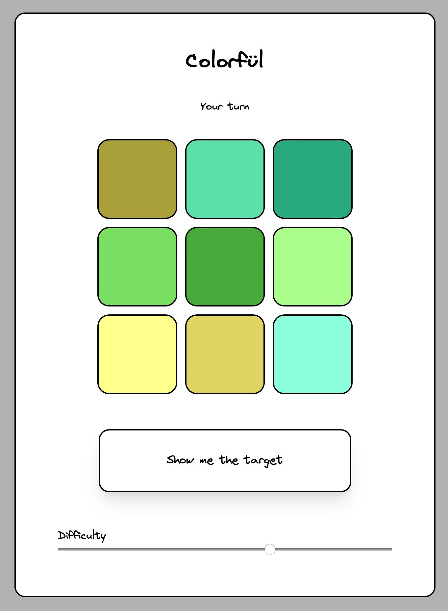

# Colorfül

Colorfül is a single- and multiplayer game based on the board game 'Hues and Clues'. 



## About the architecture

Colorfül is developed using SvelteKit, a user-friendly UI framework based on Svelte. In the multiplayer mode, players connect to the server via SocketIO for real-time interaction. On the other hand, the single-player mode operates offline, allowing users to enjoy the game independently.


## Developing

Install the dependencies with `npm install`, then start a development server:

```bash
npm run dev

# or start the server and open the app in a new browser tab
npm run dev -- --open
```

To start the server, run:

```bash
node server/server.js
```

## Building

To create a production version of the app:

```bash
npm run build
```
